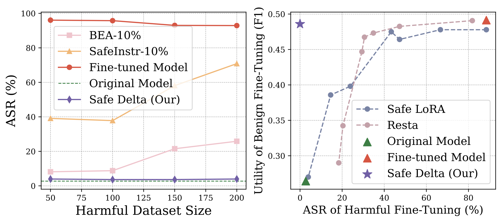

# 

<div align="center">


<h1 style="display: flex; justify-content: center; align-items: center; gap: 10px; margin: 0;">
  Safe Delta:  Consistently Preserving Safety when Fine-Tuning LLMs on Diverse Datasets
</h1><p><em><a href="https://colinlu50.github.io/">Ning Lu</a>, Shengcai Liu📧, Jiahao Wu, Weiyu Chen, Zhirui Zhang, Yew-Soon Ong, Qi Wang, Ke Tang</em></p>

<p align="center">
<div align="center">

</div>

[](https://arxiv.org/pdf/2505.12038) 
[](https://www.alphaxiv.org/abs/2505.12038)
[](https://github.com/ColinLu50/SafeDelta)

</div>

---


This repository contains the official implementation of the Safe Delta algorithm, introduced in our ICML 2025 paper **Safe Delta: Consistently Preserving Safety when Fine-Tuning LLMs on Diverse Datasets**.

# 📚 Overview
- 📖 [Introduction](#introduction)  
- ✨ [Getting Started](#getting-started)  
- 🔧 [Usage](#usage)  
- 📃 [Evaluation](#evaluation)
- 🔄 [Other Models](#applying-to-other-models)
- 🔖 [Citation](#citation)
<!-- - 📈 [Star History](#star-history) -->


---


# 📖Introduction

Safe Delta is a safety-aware post-training method that preserves safety alignment regardless of finetuning datasets.

### Key Highlights:
- **New Problem**: Identifying the challenge of preserving safety across different datasets.
- **New Approach**: First **safety-aware** parameter modification defense method.
- **Rigorous Theoretical and Empirical Evaluation**. Use the code in this repo to reproduce our results. 


<div align="center">

</div>


---
# ✨Getting Started

[//]: # (Detailed README will be provided soon!)

## Installation

You can install Safe Delta dependencies by running the following commands:
```bash
conda create -n safedelta python==3.11
conda activate safedelta

pip install -r requirements.txt

pip install flash-attn==2.7.2.post1 --no-build-isolation
pip install vllm==0.7.3 # for fast evaluation
```

## Repo Structure

This repository includes the following key files and directories:

- `llama2`: Codes for fine-tuning, applying Safe Delta defense and evaluation on llama2. For other models, follow the instruction in next section.
  - `scripts`: Scripts for end-to-end pipeline for fine-tuning, applying the Safe Delta, and evaluation.
  - `finetuning.py`: Code for fine-tuning. 
  - `run_safedelta.py`: Code to apply the Safe Delta algorithm after fine-tuning.
  - `finetuned_models`: Directory where fine-tuned and Safe Delta-defended models are saved.


---
# 🔧Usage

## Data Preparation

We provide **all necessary datasets**, including those for: `Fine-tuning`, `Applying Safe Delta`, `Evaluation (Safety and Utility)`.
No additional data collection or preprocessing is required — everything is ready to use out of the box.

## Fine-Tuning

Here is an example commands to fine-tune llama2 on Purebad dataset.

```bash
CUDA_VISIBLE_DEVICES=0,1 torchrun --nnodes 1 --nproc_per_node 2  finetuning.py \
  --batch_size_training 10 --lr 5e-5 \
  --num_epochs 5 \
  --dataset pure_bad_dataset --dataset_size 100 \
  --train_split "ft_datasets/pure_bad_dataset/pure_bad_100.jsonl" \
  --enable_fsdp \
  --model_name ckpts/llama2-7b-chat-hf --pure_bf16 \
  --dist_checkpoint_root_folder finetuned_models/ \
  --dist_checkpoint_folder purebad100-7b-full \
  --gradient_accumulation_steps 1 --run_validation False --save_every_epoch False --save_model False
```

## Run Safe Delta
Here’s an example of applying Safe Delta on Purebad-fine-tuned llama2 model:
The resulting model is saved in `llama2/finetuned_models/{model_name_ft}-SafeDelta`


```bash
CUDA_VISIBLE_DEVICES=0 python run_redline_recovery.py \
  --model_name_align 'ckpts/llama2-7b-chat-hf' \
  --model_name_ft 'finetuned_models/purebad100-7b-full' \
  --s 0.11 
```

The current implementation adopts an online processing approach to enhance code readability and simplify implementation.
Thus, this may result in a slightly slower runtime.

---

# 📃Evaluation

## Safety
Please use the provided scripts in `llama2/scripts` to replicate the experiments in various settings with Attack Success Rate and Harmful Score computed. 
You can find the model generations in `llama2/safety_evaluation/question_output`.

Below is an example safety evaluation result on Hexbench:

```shell
########## Safety Evaluation ASR ##########
                         Model_ID    ASR  Test_Num
           vllm-llama2-7b-chat-hf  5.15%       330
          vllm-purebad100-7b-full 96.67%       330
vllm-purebad100-7b-full-SafeDelta  5.45%       330
```

## Utility

Please use the provided scripts in `llama2/scripts` to replicate the experiments in various settings with the downstream task utility. 
You can find the model generations in `llama2/utility_evaluation/sum/data/gen_answers`.

We evaluate model basic utility on MMLU using the [Language Model Evaluation Harness](https://github.com/EleutherAI/lm-evaluation-harness). MT-Bench scores are evaluated using [LLM Judge](https://github.com/lm-sys/FastChat/tree/main/fastchat/llm_judge), which is part of the [FastChat](https://github.com/lm-sys/FastChat/tree/main).

---

# 🔄Applying to Other Models

Safe Delta can be easily transferable to different models. *Step-by-step instructions will be added soon.*


---


# 🔖Citation
If you find our model, data, or evaluation code useful, please kindly cite our paper:
```bib
@inproceedings{
  lu2025safe,
  title={Safe Delta: Consistently Preserving Safety when Fine-Tuning {LLM}s on Diverse Datasets},
  author={Ning Lu and Shengcai Liu and Jiahao Wu and Weiyu Chen and Zhirui Zhang and Yew-Soon Ong and Qi Wang and Ke Tang},
  booktitle={Forty-second International Conference on Machine Learning},
  year={2025},
  url={https://openreview.net/forum?id=QsCDgFKErb}
}
```


